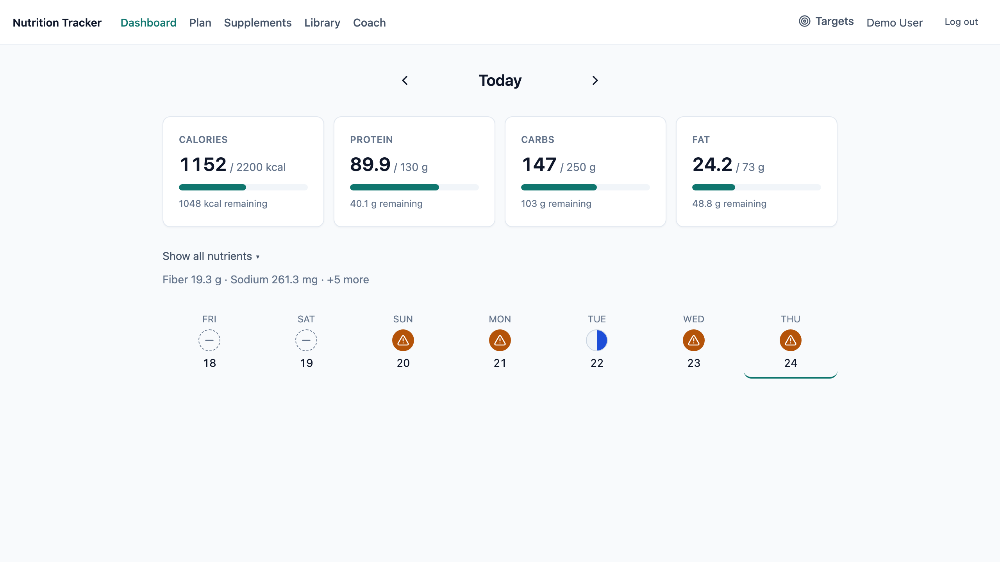
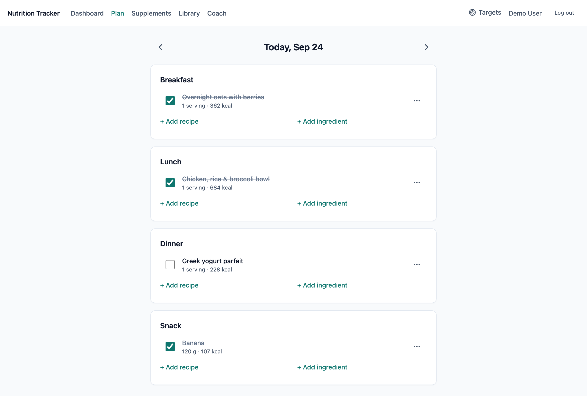
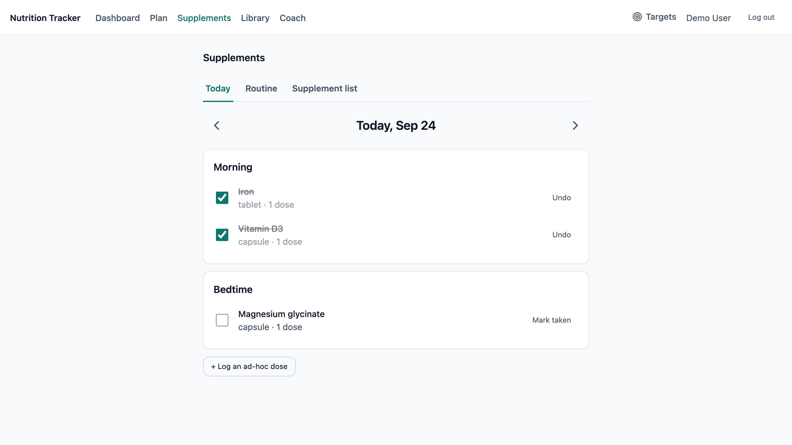
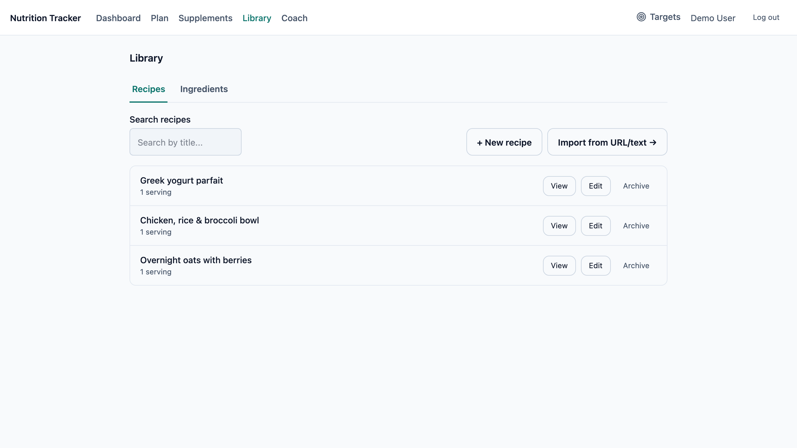
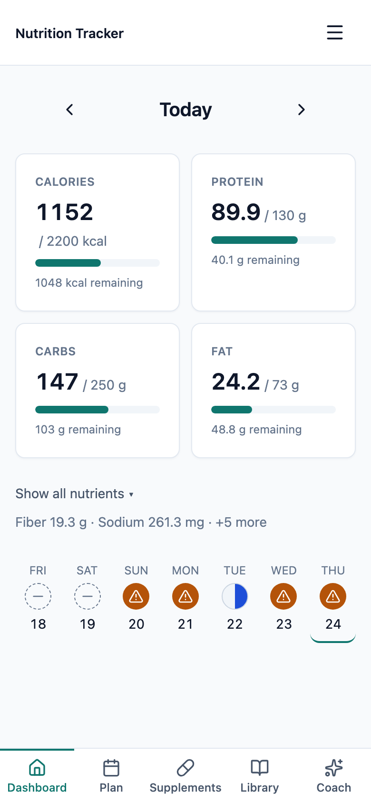

# Nutrition Tracker

A self-hosted web application for meal planning, food and supplement logging,
and nutrient tracking against daily targets. An LLM-based coach analyzes logged
intake and produces prioritized recommendations.



<table>
<tr>
<td width="33%"></td>
<td width="33%"></td>
<td width="33%"></td>
<td rowspan="2" width="20%"></td>
</tr>
<tr>
<td align="center">Planner</td>
<td align="center">Supplements</td>
<td align="center">Library</td>
</tr>
</table>

## Features

- **Dashboard:** daily totals for 11 nutrients against user-defined targets, with a seven-day history.
- **Meal planner:** recipes and individual ingredients (by weight) assigned to meals; only items marked as eaten count toward totals.
- **Supplements:** per-dose nutrient content, weekly schedules with optional time slots, and dose tracking.
- **Library:** recipe and ingredient management; recipes referenced by past logs are archived rather than deleted.
- **Recipe import:** LLM extraction from a URL or pasted text, followed by a review step that matches each line to a known ingredient.
- **Coach:** LLM analysis of logged intake against targets over a 3–30 day window.
- **Accounts:** multi-user, with per-user data isolation.

## Tech stack

| Component | Technology |
|---|---|
| Client | React 19, TypeScript, Vite, TanStack Query, React Router, Tailwind CSS 4 |
| Server | Node.js, Express 5, TypeScript, Zod |
| Database | PostgreSQL 17, node-pg-migrate |
| LLM | Google Gemini |

## Getting started

Requirements: Node.js 20+, PostgreSQL 17.

```bash
createuser nutrition_app --pwprompt
createdb nutrition_tracker_dev --owner nutrition_app

cp .env.example .env
npm install
npm run migrate:up
npm run dev
```

The API runs on port 3000 and the client on http://localhost:5173.

| Variable | Description |
|---|---|
| `DATABASE_URL` | PostgreSQL connection string |
| `SESSION_SECRET` | Secret used to sign session cookies |
| `LLM_PROVIDER` | `gemini` |
| `GEMINI_API_KEY` | Google AI Studio API key |
| `GEMINI_MODEL` | Optional. Default: `gemini-3.6-flash` |

| Command | Description |
|---|---|
| `npm run dev` | Start the API and client with live reload |
| `npm run typecheck` | Type-check the server and client |
| `npm run build` | Build the server and client for production |
| `npm start` | Run the production build (`NODE_ENV=production` serves the client) |
| `npm run migrate:up` / `migrate:down` | Apply or revert database migrations |

## License

[MIT](LICENSE)
